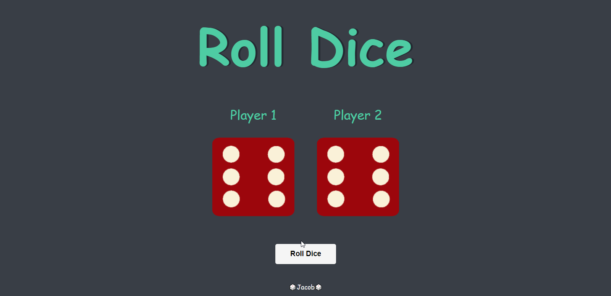

# Dice Game

<h1>Dice Game made with HTML, CSS and Javascript</h1>
Practicing javascript DOM manipulation to create a dice game website.Uunder the guidance of Dr. Angela Yu. When the "roll dice" button is clicked, The player with the higher number wins, if there is a tie, they draw. That's it, time to roll the dice 🎲🎲

## Table of contents

- [Overview](#overview)
  - [Screenshot](#screenshot)
  - [Link](#link)
- [My process](#my-process)
  - [Built with](#built-with)
  - [Useful resources](#useful-resources)
- [Author](#author)

## Overview

### Screenshot

### Link

- Live Site URL: [Dice Game](https://2player-dice-game.netlify.app/)

## My process

### Built with

- Semantic HTML5 markup
- CSS custom properties
- Javascript

### Useful resources

- [The Complete 2023 Web Development Bootcamp](https://www.udemy.com/course/the-complete-web-development-bootcamp/).

## Author

- Twitter - [@jacobxavier\_](https://twitter.com/jacobxavier_?t=YdJHQngdQYJVbC7mWspqDg&s=08)
